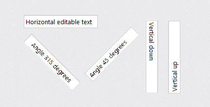

# VclRotatedEdit

`VclRotatedEdit` is a single-line VCL edit control that can render and edit text horizontally, vertically, or at an arbitrary angle while keeping normal edit-control behavior such as caret movement, selection, clipboard operations, validation, VCL styles and design-time resizing.

Copyright (c) 2026 Marc BAUMSTIMLER  
Repository: https://github.com/mbaumsti/VclRotatedEdit  
License: see the `LICENSE` file.


<p align="center">
  
</p>

---

## Purpose

A standard `TEdit` is axis-aligned. `TRotatedEdit` keeps the text-editing model canonical and horizontal internally, then projects the edit surface to the requested angle for rendering, hit-testing, caret drawing and selection.

The component is designed for VCL applications that need editable labels, compact rotated fields, vertical editing surfaces, or custom-angle text input without switching to a fully custom editor framework.

---

## Main features

- Single-line editable text control.
- Horizontal, vertical-down, vertical-up and custom-angle orientations.
- Arbitrary angle rendering through the `Angle` property.
- Stable logical dimensions through `LogicalLength` and `LogicalThickness`.
- Native-like `AutoSize` support for the logical thickness of a single-line edit surface.
- Caret, selection and mouse hit-testing aligned with the rotated text flow.
- Clipboard and selection support: copy, cut, paste, select all, selected-text replacement and clear selection.
- `ReadOnly`, `MaxLength`, `CharCase`, `NumbersOnly`, `TextHint` and alignment support.
- `RenderBackend` property for selecting the rendering backend. `rebDirect2D` is the default renderer and uses Direct2D / DirectWrite when native resources are available; `rebGDI` keeps the historical GDI renderer available for compatibility and fallback.
- VCL style-aware rendering through `PaletteMode` and `StyleElements`.
- Style-derived border metrics so the editable area follows the active VCL style instead of assuming a fixed one-pixel border.
- Design-time selection markers for shaped/rotated controls.
- Protected design-time resizing: one drag changes either logical length or logical thickness, never both.
- Protection against invalid design-time resize rectangles.
- Design-time drag repaint protection over container controls such as `TGroupBox`.
- GDI fallback renderer corrected for arbitrary-angle text rendering without rotating ClearType-rasterized text bitmaps.
- Rendering backend boundary prepared so a future Direct2D/DirectWrite backend can own both rendering and text metrics.
- Event set close to what developers expect from an edit control, plus specific editing events.

---

## Important concepts

### Physical bounds

`Left`, `Top`, `Width` and `Height` are the normal VCL rectangular bounds. They describe the external Windows control rectangle.

### Logical size

`LogicalLength` and `LogicalThickness` describe the editable surface before rotation.

- `LogicalLength`: dimension along the text flow axis.
- `LogicalThickness`: dimension perpendicular to the text flow axis.

For a rotated control, `Width` and `Height` are not the editable dimensions. They are only the external box that contains the rotated logical edit surface.

### AutoSize and logical thickness

`AutoSize` follows the naming convention of `TEdit`, but it acts on the logical edit surface.

- When `AutoSize = True`, the component updates `LogicalThickness` to a native-like single-line edit height for the current font, style and border.
- When `AutoSize = False`, the user may set a smaller or larger `LogicalThickness`.
- If the logical thickness is smaller than the native-like value, the normal top margin is preserved and the lower part is clipped, matching the behavior expected from a single-line edit control.
- If the logical thickness is larger than the native-like value, the text band is visually re-centered inside the enlarged editable area.

Text vertical placement is intentionally based on the visible `W` glyph band for better visual centering, while caret, selection and hit-testing remain aligned through the same layout result.

### Orientation and angle

`Orientation` is a convenience property for common modes:

- `reoHorizontal`
- `reoVerticalDown`
- `reoVerticalUp`
- `reoCustomAngle`

`Angle` is the effective rotation angle in degrees. When `Orientation = reoCustomAngle`, `Angle` is directly controlled by the user.

Validated convention:

- `reoVerticalDown` means visual text flow from top to bottom and maps to `270°`.
- `reoVerticalUp` means visual text flow from bottom to top and maps to `90°`.

This convention must remain centralized in the geometry unit so rendering, caret, selection, hit-testing and layout stay coherent.

---

## Design-time behavior

The component intentionally separates the external VCL rectangle from the internal editable surface.

Rules:

- Loading a DFM must preserve the streamed external bounds.
- Changing `LogicalLength` or `LogicalThickness` recalculates the external bounds.
- Changing `Angle` or `Orientation` recalculates the external bounds while keeping the external center stable.
- During a design-time resize drag, only one logical axis changes:
  - either `LogicalLength`,
  - or `LogicalThickness`,
  - never both.
- If a design-time resize would produce an invalid or too-small rectangle, the component restores the last valid geometry.
- During design-time dragging, the control avoids repainting the full parent surface into its own background, so containers such as `TGroupBox` do not leak their border or caption into the rotated edit background.

These rules prevent the component from jumping or drifting when switching between form view and text DFM view.

---

## Style support

`PaletteMode` selects how rendering colors are resolved:

- `repmStyle`: use the resolved VCL style palette when possible.
- `repmCustom`: use `Color`, `Font.Color` and `BorderColor`.

At runtime, the component keeps the style-resolution behavior that matches application styles. At design time, it uses the parent/control style context so the owner-drawn surface follows the style shown by the form designer.

`StyleElements` is honored:

- `seClient`: style controls the edit background.
- `seFont`: style controls the text color.
- `seBorder`: style controls the border color.

---

## Public properties

Common edit-style properties:

- `Text`
- `ReadOnly`
- `MaxLength`
- `Alignment`
- `CharCase`
- `TextHint`
- `NumbersOnly`
- `BorderStyle`
- `BorderColor`
- `TextPaddingStart`
- `TextPaddingEnd`

Rotated-edit specific properties:

- `Orientation`
- `Angle`
- `LogicalLength`
- `LogicalThickness`
- `AutoSize`: automatically maintains a native-like logical thickness for the current font/style.
- `AutoSizeBounds`
- `PaletteMode`
- `ShowDesignMarkers`

Runtime selection state:

- `CaretIndex`
- `SelStart`
- `SelLength`
- `SelText`: selected text. Assigning this property replaces the current selection or inserts text at the caret position.
- `ScrollOffset`

`Cursor` is intentionally hidden from the Object Inspector because the component uses an orientation-aware custom hover cursor. The inherited runtime property still exists as part of `TControl`, but it is not a meaningful design-time setting for `TRotatedEdit`.

---

## Public methods

Common edit-style methods:

- `Clear`: clears the whole text.
- `ClearSelection`: removes the current selection without using the clipboard.
- `SelectAll`: selects the whole text.
- `CopyToClipboard`: copies the current selection to the clipboard.
- `CutToClipboard`: cuts the current selection to the clipboard when the control is not read-only.
- `PasteFromClipboard`: inserts clipboard text at the caret position or replaces the current selection.
- `AutoSizeToLogicalBounds`: recalculates the external bounds from the current logical size and angle.

---

## Events

Standard-style events include:

- `OnChange`
- `OnClick`
- `OnContextPopup`
- `OnDblClick`
- `OnEnter`
- `OnExit`
- `OnKeyDown`
- `OnKeyPress`
- `OnKeyUp`
- `OnMouseDown`
- `OnMouseEnter`
- `OnMouseLeave`
- `OnMouseMove`
- `OnMouseUp`
- `OnMouseWheel`
- `OnMouseWheelDown`
- `OnMouseWheelUp`

Specific events:

- `OnSelectionChange`: fired when `CaretIndex`, `SelStart` or `SelLength` changes.
- `OnEditingStart`: fired once when the first accepted user text mutation starts an editing session.
- `OnCanChange`: allows a normalized candidate text value to be accepted or rejected before it becomes `Text`.
- `OnValidate`: validates the final value when editing is completed.
- `OnEditingDone`: reports why editing ended.

---

## Basic usage

```pascal
uses
    VclRotatedEdit,
    VclRotatedEdit_Types;

procedure TForm1.FormCreate(Sender: TObject);
begin
    RotatedEdit1.Text := 'Vertical text';
    RotatedEdit1.Orientation := reoVerticalDown;
    RotatedEdit1.LogicalLength := 160;
    RotatedEdit1.LogicalThickness := 28;
end;
```

Custom angle:

```pascal
procedure TForm1.FormCreate(Sender: TObject);
begin
    RotatedEdit1.Orientation := reoCustomAngle;
    RotatedEdit1.Angle := 340;
    RotatedEdit1.Text := 'Custom angle';
end;
```

Immediate change filtering:

```pascal
procedure TForm1.RotatedEdit1CanChange(
    Sender: TObject;
    const AOldText, ANewText: string;
    var ACanChange: Boolean);
begin
    ACanChange := Pos('!', ANewText) = 0;
end;
```

Selected-text replacement:

```pascal
procedure TForm1.ReplaceSelectionButtonClick(Sender: TObject);
begin
    RotatedEdit1.SelText := 'replacement';
end;
```

Clear the current selection without using the clipboard:

```pascal
procedure TForm1.ClearSelectionButtonClick(Sender: TObject);
begin
    RotatedEdit1.ClearSelection;
end;
```

---

## Source layout

- `VclRotatedEdit.pas`: public component facade.
- `VclRotatedEdit_Core.pas`: component state, published API, input handling and design-time resize policy.
- `VclRotatedEdit_Types.pas`: shared types and event signatures.
- `VclRotatedEdit_Geometry.pas`: projection and angle helpers.
- `VclRotatedEdit_Layout.pas`: canonical text/caret/selection layout.
- `VclRotatedEdit_Render.pas`: historical GDI owner-drawn rendering pipeline.
- `VclRotatedEdit_RenderBackend.pas`: common rendering and text-metric backend contract plus backend factory.
- `VclRotatedEdit_RenderBackend_GDI.pas`: historical GDI backend implementation.
- `VclRotatedEdit_RenderBackend_Direct2D.pas`: Direct2D/DirectWrite backend implementation with a private GDI fallback for native-resource or drawing failures.
- `VclRotatedEdit_Style.pas`: style, color and border-metric resolution.
- `VclRotatedEdit_EditEngine.pas`: pure text mutation engine.
- `VclRotatedEdit_Caret.pas`: caret blink controller.
- `VclRotatedEdit_Clipboard.pas`: clipboard helpers.
- `VclRotatedEdit_Design.pas`: design-time selection support.
- `VclRotatedEdit_Reg.pas`: design-time registration.

---

## PasDoc

The source files contain unit headers and declaration comments intended to be consumable by PasDoc.

The repository includes PasDoc helper files at the root level:

- `pasdoc-complete.cfg`: configuration file for the complete API documentation;
- `pasdoc-sources-complete.txt`: explicit list of source units to document;
- `pasdoc.txt`: short notes and command examples.

The PasDoc introduction text is stored in:

```text
docs/api-complete-introduction.txt
```

Typical command from the repository root:

```text
pasdoc @pasdoc-complete.cfg
```

The generated API documentation is written to:

```text
docs/api-complete
```

The configuration intentionally documents only the public component sources from `Src`. It does not include:

- Delphi history folders such as `__history`;
- backup/copy files such as `* - Copie.pas`;
- demo sources;
- generated binary files from `Lib`.

If your PasDoc version does not support `@` response files, use the fallback command documented in `pasdoc.txt`.

---

## Current development state

The source tree currently contains two rendering backends:

- `rebDirect2D`: the default Direct2D / DirectWrite renderer. It draws in the final oriented coordinate system and avoids projecting an already-rasterized straight bitmap.
- `rebGDI`: the historical GDI renderer, kept as an explicit compatibility backend and as the fallback path used when Direct2D cannot be used.

The Direct2D backend owns the native Direct2D factory, DirectWrite factory and DC render target. It draws the background, frame, selection, text and caret without using a straight bitmap that is rotated afterwards. This rule is intentional: rendering directly in the final coordinate system avoids the edge artefacts caused by projecting already-rasterized GDI bitmaps.

The Direct2D renderer is the recommended/default path for normal use. The GDI renderer remains useful for compatibility, troubleshooting and as a safety fallback. The Direct2D backend delegates to it when native resources are unavailable or when a Direct2D operation fails.

The demo event monitor stores event counters in memory and coalesces visual grid refreshes to avoid flicker while keeping all event counts exact.
